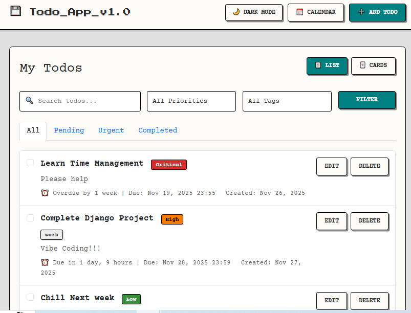
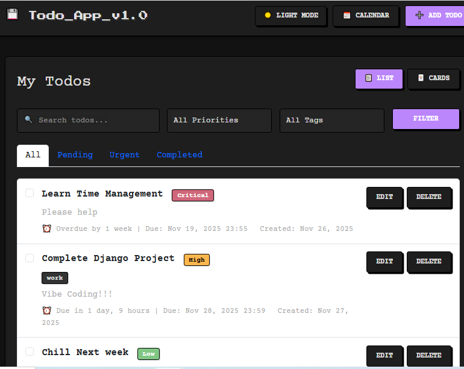

# Retro 90s Todo App 💾

A nostalgic, feature-rich Task Management System built with Django. It channels the aesthetic of **Windows 95** (Light Mode) and **Retro Hacker Terminals** (Dark Mode) while packing modern functionality under the hood.

## 📸 Screenshots

| Light Mode (Windows 95) | Dark Mode (Terminal) |
|:-----------------------:|:--------------------:|
|  |  |

## ✨ Features

### Core Functionality
-   **Automated Priority System**: You don't set priorities manually! The app automatically calculates urgency based on the due date:
    -   **Critical**: Due within 24 hours (or overdue)
    -   **High**: Due within 3 days
    -   **Medium**: Due within 7 days
    -   **Low**: Due in more than a week
-   **Todo Management**: Full CRUD operations (Create, Read, Update, Delete).
-   **Quick Dates**: "Today", "Tomorrow", and "Next Week" buttons for rapid scheduling.
-   **Tagging**: Organize tasks with comma-separated tags (e.g., "work, urgent").

### Views & Visualization
-   **Dual Views**: Toggle between a **Card Grid** (modern) and a **List View** (classic).
-   **Calendar View**: A robust monthly calendar.
    -   Scrollable day cells (handles unlimited todos per day).
    -   Click any todo to edit it instantly in a popup modal.
-   **Search & Filter**:
    -   Real-time filtering by Status, Priority, and Tags.
    -   Search bar for finding tasks by title.

### Design & UX
-   **Dual Retro Themes**:
    -   ☀️ **Light Mode**: Inspired by **Windows 95**. Teal backgrounds, silver windows, and 3D beveled borders.
    -   🌙 **Dark Mode**: Inspired by **DOS Terminals**. High-contrast black backgrounds with neon green text.
-   **Typography**: Uses *'Press Start 2P'* for headers (8-bit style) and *'Courier Prime'* for high-readability body text.
-   **Interactive UI**: Buttons and cards feature "clicky" 3D press effects.

## 🚀 Setup Instructions

1.  **Prerequisites**: Python 3.12+.

2.  **Navigate to the project directory**:
    ```bash
    cd todo-app-django
    ```

3.  **Install Dependencies**:
    ```bash
    pip install django
    ```

4.  **Initialize Database**:
    ```bash
    python manage.py makemigrations
    python manage.py migrate
    ```

5.  **Run the Server**:
    ```bash
    python manage.py runserver
    ```

6.  **Access the App**: Open `http://127.0.0.1:8000/`

## 📁 Project Structure

-   `manage.py`: Django's command-line utility.
-   `todo_project/`: Project configuration directory (settings, urls)
-   `todo/`: Main application folder.
    -   `models.py`: Database logic (includes the `save` override for auto-priority).
    -   `views.py`: Request handling (ListView, Calendar logic, search, filters).
    -   `urls.py`: URL routing for the app
    -   `forms.py`: Form definitions (Date widgets, validation).
    -   `templates/todo/`: HTML files with retro styling.
        -   `base.html`: Base template with retro theme
        -   `todo_list.html`: List and card views
        -   `todo_calendar.html`: Calendar view
        -   `todo_form.html`: Create/edit form
    -   `templatetags/`: Custom filters for dictionary lookups in templates.
    -   `migrations/`: Database migration files

```
todo-app-django/
├── db.sqlite3                  # SQLite database file
├── INFORMATION.md              # Detailed project documentation and learning guide
├── manage.py                   # Django's command-line utility
├── README.md                   # Project overview and setup instructions
├── screenshots/                # Project screenshots
├── todo_project/               # Project configuration directory
│   ├── asgi.py                 # ASGI config for async deployment
│   ├── settings.py             # Main settings (database, apps, middleware)
│   ├── urls.py                 # Root URL configuration
│   └── wsgi.py                 # WSGI config for sync deployment
└── todo/                       # Main application directory
    ├── admin.py                # Admin panel configuration
    ├── apps.py                 # App configuration
    ├── forms.py                # Form definitions (TodoForm)
    ├── models.py               # Database models (Todo)
    ├── tests.py                # Unit tests
    ├── urls.py                 # App-specific URL routing
    ├── views.py                # View logic (ListView, CreateView, etc.)
    ├── migrations/             # Database migrations
    │   ├── 0001_initial.py
    │   └── 0002_todo_priority_todo_tags.py
    ├── templates/              # HTML Templates
    │   └── todo/
    │       ├── base.html                   # Base template with retro styling
    │       ├── todo_calendar.html          # Calendar view template
    │       ├── todo_confirm_delete.html    # Delete confirmation page
    │       ├── todo_form.html              # Create/Edit form page
    │       ├── todo_form_partial.html      # Partial form for AJAX modals
    │       └── todo_list.html              # Main list and card view
    └── templatetags/           # Custom template tags
        ├── __init__.py
        └── todo_extras.py      # Custom filters (e.g., dictionary lookup)
```

## 🎨 Design Philosophy

The app rejects modern "flat" design in favor of a tactile, 90s computing feel:
-   **Beveled Edges**: Borders use explicit light (`#ffffff`) and dark (`#888888`) sides to create 3D depth (outset/inset styles).
-   **Monospaced Fonts**: Everything looks like code or a typewriter.
-   **High Contrast**: Designed for clarity, mimicking older CRT monitors.

## 🛠️ Technologies Used

-   **Backend**: Django 5.2, Python 3.12
-   **Frontend**: HTML5, CSS3 (Variables), JavaScript (Fetch API)
-   **Styling**: Bootstrap 5 (Structure) + Custom CSS (Retro Theme)
-   **Database**: SQLite (default Django database)
-   **Fonts**: Google Fonts (Press Start 2P, Courier Prime)

## 📝 Usage Tips

1.  **Quick Date Selection**: Use the quick date buttons (Today, Tomorrow, Next Week) when creating/editing todos
2.  **Priority System**: Assign priorities to help organize your tasks - Critical items are highlighted in red
3.  **Tags**: Use comma-separated tags to categorize todos (e.g., "work, urgent, meeting")
4.  **Calendar Editing**: Click any todo in the calendar view to edit it in a popup modal
5.  **Theme Toggle**: Click the theme toggle button (top-right) to switch between dark and light modes
6.  **Search & Filter**: Combine search with filters for powerful todo organization

## 🔮 Future Enhancements

-   Recurring todos
-   Subtasks/checklists
-   File attachments
-   Collaboration features
-   Email notifications
-   Mobile app

## 📄 License

Open source for educational purposes.